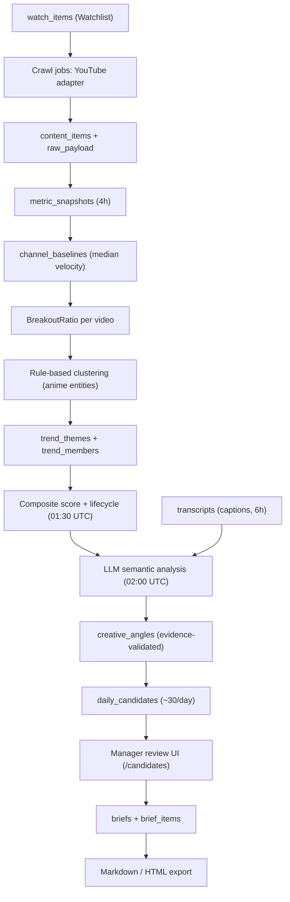

# Overview

Desiderium 是一个单实例番剧趋势情报系统，由三个进程组成：FastAPI Web（SSR 管理后台 + API）、APScheduler Worker（采集与分析任务）、PostgreSQL 16。外部平台（YouTube / TikTok / 字幕 / LLM）全部通过独立适配器接入，领域层不依赖任何具体供应商。

本仓库同时内嵌 Paradigma Memory-Bank harness（`memory-bank/`、`.paradigma/tools/`、`AGENT_RULES.md`），用于 Agent 长期记忆维护，与应用运行时互不依赖。

# Technology Stack

| Layer | Choice | Notes |
|-------|--------|-------|
| Language | Python ≥ 3.12 | `pyproject.toml` |
| Web | FastAPI + Uvicorn | SSR 页面用 Jinja2 + HTMX + Tailwind CDN |
| ORM / Migration | SQLAlchemy 2 async + asyncpg + Alembic | 迁移随容器启动自动执行 |
| Database | PostgreSQL 16 | 单库，含时间序列快照表 |
| Scheduling | APScheduler（独立 worker 进程） | 无 Redis / Celery；互斥用 PG advisory lock |
| Config | pydantic-settings（`.env`）+ YAML（`config/`） | 算法阈值全部在 `config/scoring.yaml` |
| HTTP client | httpx（async） | YouTube / TikTok / LLM 调用 |
| Testing | pytest + pytest-asyncio | `tests/unit/`，75 个测试 |
| Deployment | Docker Compose（dev/prod）、Caddy HTTPS、systemd 可选 | `docker-compose.prod.yml`、`deploy/` |
| Agent memory | Paradigma harness（OKF-compatible Markdown） | `.paradigma/tools/` 标准库 Python |

# Module Boundaries

| Module | Responsibility | Path |
|--------|----------------|------|
| Web entry | FastAPI app、路由挂载、Auth 中间件 | `app/main.py`、`app/web/middleware.py` |
| Worker entry | APScheduler 进程、心跳持久化 | `app/worker.py`、`app/jobs/scheduler.py` |
| Domain | 平台无关接口与纯算法（年龄桶、速度、BreakoutRatio、来源置信度） | `app/domain/` |
| Adapters | YouTube / TikTok / 字幕 / LLM 平台隔离 | `app/adapters/{youtube,tiktok,transcript,llm}/` |
| Services | 采集、快照、基准、聚类、评分、生命周期、语义分析、候选生成、简报导出、运维状态 | `app/services/` |
| Repositories | 数据访问层（async session） | `app/repositories/` |
| Models | 18 张表的 ORM 定义与枚举 | `app/models.py` |
| Jobs | 定时任务（crawl / trend / transcript / semantic / tiktok / ops）+ 互斥 | `app/jobs/` |
| Web UI | SSR 路由 + Jinja 模板（五页业务界面） | `app/web/routes/`、`app/web/templates/` |
| Runtime config | scoring / llm / tiktok / prompts / 实体词典 | `config/` |
| Migrations | Alembic 版本链 | `migrations/versions/` |
| Shadow scripts | Stage 1 影子验证管道与 golden dataset | `scripts/shadow/`、`data/shadow/` |
| Ops scripts | 备份 / 恢复 / 磁盘监控 / 索引优化 | `scripts/`、`OPS.md`、`RECOVERY.md` |
| Memory-Bank harness | Agent 记忆与确定性校验工具 | `memory-bank/`、`.paradigma/tools/` |

依赖方向：`web / jobs → services → domain`，`services → repositories → models`，`services → adapters`。领域层不得 import 适配器或 SDK。

# Data Flow

TikTok 实验数据在启用时经 `TikTokIngestionService` 进入 `content_items`，标记 `source_confidence: low`，失败不影响主流程。

# Key Constraints

- LLM 不参与数值计算、评分或原始数据修改；所有 LLM 结论必须携带存在于 trend members 中的证据视频 ID。
- 所有算法阈值与权重集中在 `config/scoring.yaml`，服务代码不得硬编码常量。
- 适配器隔离：YouTube 与 TikTok 不共享平台逻辑；TikTok 默认关闭（`TIKTOK_ENABLED=false`），失败被隔离在独立任务与重试循环中。
- 幂等写入：`content_items` 唯一约束 `(platform, external_id)`；快照唯一约束 `(content_item_id, captured_at_bucket)`（小时桶）。
- 趋势主题跨日复用同一 ID（按 entity / canonical name 匹配），不得每日重建。
- 任务互斥：进程内锁 + PostgreSQL advisory lock + DB running-batch 检查，防止重复运行。
- 密钥只存在于 `.env`（gitignored）；TikTok cookie 不得写入日志。
- `memory-bank/runtime/` 不进入 OKF knowledge bundle；`knowledge/` 与 `docs/rfc/` 的 concept 文档必须通过 strict lint。

# Open Questions

- **CI 覆盖缺口**：`.github/workflows/check.yml` 只在 Python 3.11 上运行 memory-bank 校验，未运行应用 pytest（应用要求 ≥3.12），也未验证 Alembic 迁移。
- **聚类第二 / 三层未实现**：MVP 只有规则聚类（`config/anime_entities.yaml`）；文本向量召回与 LLM 歧义裁决仍是设计目标（见 mvp-plan 第 9 节）。
- **冷启动基准**：系统上线前 2—4 周只有低置信度估算基准，见 known-issue。
- **影子验证误报**：Hindi / manhwa 内容触发高共振误报，语言过滤与 manager-value 惩罚待校准，见 known-issue。
- **团队账号反馈闭环**：`published_views/likes/comments` 字段已预留但未接入自有 YouTube 账号数据。
- **初始迁移策略**：initial revision 使用 `Base.metadata.create_all`，后续 schema 变更需改为显式 op 脚本。
- **单管理者假设**：认证是单密码 + 签名 session cookie；多用户 / RBAC 是明确的 post-MVP 项。

# Citations

- [MVP Plan](plans/mvp-plan.md)
- [Operations Manual](../../OPS.md)
- [Recovery Guide](../../RECOVERY.md)
